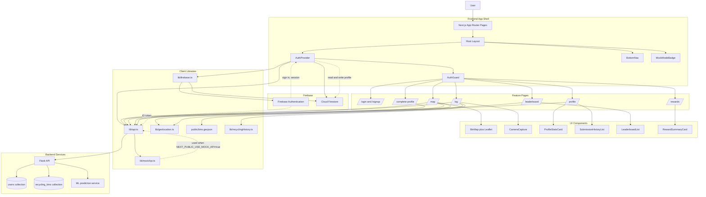

# EcoBin Go Frontend

Mobile-first Next.js 14 frontend for a recycling gamification app with Firebase auth, Firestore profile onboarding, Leaflet maps, camera-only activity logging, and a switchable mock API layer.

## Stack

- Next.js 14 App Router
- TypeScript
- Tailwind CSS
- Firebase Authentication
- Firestore
- Leaflet via `react-leaflet`

## Frontend Architecture



## Technology Overview

The frontend is a mobile-first Next.js 14 application built with the App Router, TypeScript, and Tailwind CSS. Shared app state is managed through `AuthProvider` in `src/context/AuthContext.tsx`, while route protection is handled by `src/components/auth/AuthGuard.tsx`. Feature pages under `src/app/` call a small client service layer in `src/lib/api.ts`, and Leaflet is loaded client-side for the interactive map in `src/components/map/BinMap.tsx`.

Firebase is used in two ways. Firebase Authentication manages email/password and Google sign-in, and the browser keeps that session with local persistence from `src/lib/firebase.ts`. Firestore stores the frontend-owned profile record in `profiles/{firebaseUid}` so the app can tell whether a signed-in user has completed onboarding and what username should be shown in the UI.

## Firebase Auth And Backend Sync

The frontend and backend are synchronized through the Firebase ID token. After a user signs in, `src/lib/api.ts` calls `auth.currentUser.getIdToken()` and sends that token in the `Authorization: Bearer <token>` header for backend requests. The Flask backend verifies that token, identifies the Firebase user, and uses that identity to read or update backend data such as the `users` collection, leaderboard ranks, recycling transactions, and nearby bin queries.

There are two profile layers by design. The frontend creates and reads a Firestore profile document in `profiles/{firebaseUid}` for onboarding and UI state, while it separately calls backend endpoints such as `/api/v1/users/init`, `/api/v1/users/profile`, `/api/v1/users/stats`, `/api/v1/users/region`, and `/api/v1/leaderboard` to keep the backend-owned `users` record aligned. In practice, signup or Google profile completion writes the Firebase-side profile first and then initializes the backend user record, and username edits call the backend update endpoint before updating the Firestore profile so both systems stay consistent.

## Routes

- `/login`
- `/signup`
- `/complete-profile`
- `/map`
- `/log`
- `/leaderboard`
- `/rewards`
- `/profile`

Protected pages are wrapped with `AuthGuard`. Unauthenticated users are redirected to `/login`. Google users without a Firestore profile are redirected to `/complete-profile`.

## Environment Variables

Create `.env.local`:

```bash
NEXT_PUBLIC_API_BASE_URL=http://localhost:8000
NEXT_PUBLIC_USE_MOCK_API=true
NEXT_PUBLIC_MOCK_VERIFY_RESULT=random

NEXT_PUBLIC_FIREBASE_API_KEY=
NEXT_PUBLIC_FIREBASE_AUTH_DOMAIN=
NEXT_PUBLIC_FIREBASE_PROJECT_ID=
NEXT_PUBLIC_FIREBASE_STORAGE_BUCKET=
NEXT_PUBLIC_FIREBASE_MESSAGING_SENDER_ID=
NEXT_PUBLIC_FIREBASE_APP_ID=
```

## Firebase Notes

The app expects:

- Firebase Authentication enabled for Email/Password
- Google Sign-In enabled if you want Google login
- Firestore enabled

Collections used:

- `profiles/{firebaseUid}`
- `usernames/{normalizedUserId}`

The `usernames` collection is used to enforce unique usernames with a Firestore transaction.

## Install and Run

```bash
npm install
npm run dev
```

Open `http://localhost:3000`.

## Mock API Mode

When `NEXT_PUBLIC_USE_MOCK_API=true`, the app bypasses the backend and returns simulated responses with network delay for:

- nearby bins
- activity verification
- leaderboard
- user stats
- submission history

`NEXT_PUBLIC_MOCK_VERIFY_RESULT` supports:

- `random`
- `success`
- `failure`

The UI shows a `Mock Mode` badge when mock mode is enabled.

## Camera Logging Flow

The `/log` page:

- uses `navigator.mediaDevices.getUserMedia()`
- blocks file uploads
- captures the image through a canvas snapshot
- requires geolocation before submission
- submits `Latitude`, `Longitude`, `Image`, and `UserId` in multipart form data

## Map Dataset

`public/bins.geojson` contains sample NEA-style recycling bin data so the map renders immediately. Replace it with the full Singapore dataset when ready.

## Project Structure

```text
src/
  app/
  components/
  context/
  lib/
public/
  bins.geojson
```

## Build Checks

Run:

```bash
npm run typecheck
npm run build
```

Dependency installation was not run in this workspace, so build and type checks still need to be executed after `npm install`.

## Deployment: (run in root directory ../)
```bash
# Mac
gcloud builds submit . \
  --project=cs5224-grp7-3bb27 \
  --config=Backend/cloudbuild.yaml \
  --region=us-west2 \
  --substitutions=COMMIT_SHA=manual-$(date +%s),SHORT_SHA=manual$(date +%H%M%S)

# Windows
# Windows Powershell
gcloud builds submit . `
  --project=cs5224-grp7-3bb27 `
  --config="Frontend/cloudbuild.yaml" `
  --region=us-west2 `
  --substitutions="COMMIT_SHA=manual-$(Get-Date -UFormat %s),SHORT_SHA=manual$(Get-Date -Format HHmmss)"
```
