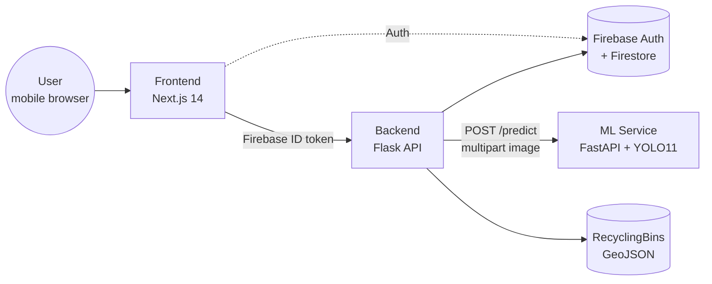
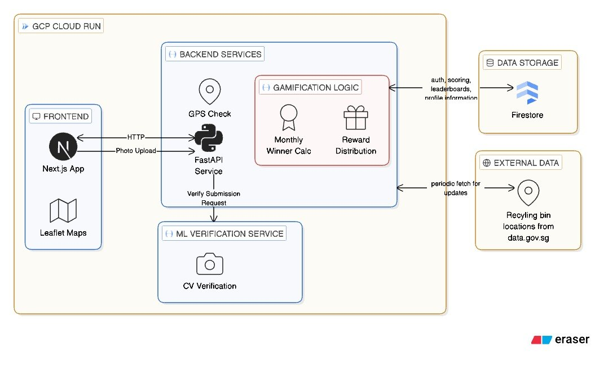

# EcoBin Go — CS5224 Group 7

A cloud-native recycling gamification platform. Users photograph items at NEA recycling bins, the system verifies the activity (image classification + GPS proximity), and awards points that drive a regional leaderboard.

Built for **NUS CS5224 — Cloud Computing**, deployed on **Google Cloud Run** across `dev`, `uat`, and `prod` environments.

## Architecture



For the full deployment topology (Cloud Run services, IAM, Firebase, Cloud Build / Cloud Deploy pipeline):



All three services run on independent Cloud Run instances and scale to zero. Auth flows through Firebase; the frontend obtains an ID token and the backend verifies it via Firebase Admin SDK on every request.

## Repository Layout

| Folder | Purpose | README |
| --- | --- | --- |
| [Backend/](Backend/) | Flask REST API — auth, verification, leaderboard, bins | [Backend/readme.md](Backend/readme.md) |
| [Frontend/](Frontend/) | Next.js 14 mobile-first PWA — login, map, camera log, leaderboard | [Frontend/readme.md](Frontend/readme.md) |
| [Machine Learning/](Machine%20Learning/) | YOLO11-Large recyclable-item detector + FastAPI inference service | [Machine Learning/readme.md](Machine%20Learning/readme.md) |
| [Deploy/](Deploy/) | Cloud Run manifests, Skaffold + Cloud Deploy pipelines per environment | [Deploy/readme.md](Deploy/readme.md) |

## Quick Start (full stack, local)

Run each in its own terminal:

```bash
# 1. ML service (port 5001)
cd "Machine Learning"
python3.12 -m venv venv && source venv/bin/activate
pip install -r requirements.txt
python main.py

# 2. Backend (port 5000)
cd Backend
python3.12 -m venv venv && source venv/bin/activate
pip install -r requirements.txt
export GOOGLE_APPLICATION_CREDENTIALS=./serviceAccountKey.json
python API_endpoints.py

# 3. Frontend (port 3000)
cd Frontend
npm install
npm run dev
```

The frontend can also run standalone with `NEXT_PUBLIC_USE_MOCK_API=true` — see [Frontend/readme.md](Frontend/readme.md).

## Tech Stack

- **Frontend:** Next.js 14 (App Router), TypeScript, Tailwind CSS, Leaflet, Firebase Auth
- **Backend:** Python 3.12, Flask, Firebase Admin SDK, gunicorn
- **ML:** Python 3.12, FastAPI, Ultralytics YOLO11, SAM3 (label-assist), OpenCV
- **Data:** Cloud Firestore (users, profiles, transactions, ranks), GeoJSON (bins)
- **Infra:** GCP Cloud Run, Cloud Build, Cloud Deploy, Artifact Registry, Skaffold, Docker

## Deployment

Each service has its own `cloudbuild.yaml` and a Cloud Deploy pipeline driven by manifests in [Deploy/](Deploy/). To trigger a build manually from the repo root:

```bash
gcloud builds submit . \
  --project=<GCP_PROJECT_ID> \
  --config=<Backend|Frontend|Machine\ Learning>/cloudbuild.yaml \
  --region=<GCP_REGION> \
  --substitutions=COMMIT_SHA=manual-$(date +%s),SHORT_SHA=manual$(date +%H%M%S)
```

Promotions through `dev → uat → prod` are handled by Cloud Deploy with manual approval gates on UAT and prod.

## Environments

| Environment | Auto-deploy | Approval |
| --- | --- | --- |
| dev  | yes | none |
| uat  | no  | required |
| prod | no  | required |
